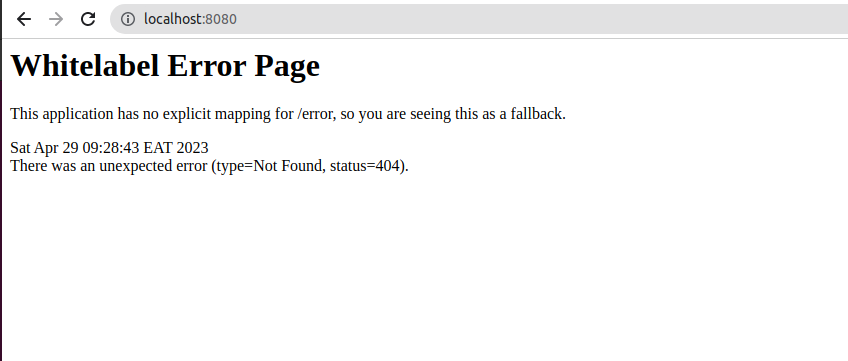

We use Spring Boot in our daily lives. We use it to create web apps, create standalone apis, create just anything web-based that we would need to work on.
In this project, we will take a step-by-step approach to open up spring boot, and look into what it has for us, and where we can plug in or replace some of the default features.
Spring Boot takes an *opinionated* stand and creates a stan-alone production-grade application that you can just run. Let's break down this definition.
**Opinionated** 
 It simply means it chooses things for you, such as third-party libraries such as embedded tomcat. At what point did you say you want to use tomcat, and that you want to use it embedded into the application? Yet it's such decisions that enable you to just run your application.
**Stand Alone**
Let's look at our tomcat example up there. Spring boot had the option of creating a servlet, that can then be deployed on to a servlet container. But that would introduce an additional step in the running of the application. Create the war file, deploy it to the servlet container. Such decisions is what enabled you to just run your application.
**Production Grade**
This is what confuses many people. Is spring-boot really production-grade? What does being production-grade mean?
Production-grade can be simplified to containing features that help run products in production. For example, in production, you need to secure your application, you need to monitoring, health-checks, externalized configuration, logging, . You need simple non-functional features that go beyond the basic hello world to have your service run comfortably in production (rather your service run, and you be comfortable).

So, let's put it together.
Spring boot puts together the basics of spring framework, adds third party libraries, sets up your default configuration, and gives you an application that is ready to run. How cool is that.

# Creating Spring Boot Project
## Prerequisites
- Java 17+ : 
There are many ways to create a spring boot project. I focus on the easiest: go to the Spring Initializr page: https://start.spring.io (one of programmer's favorite site) and fill in the details.
As of the time of writing this section, this page looks like this:

If it looks differently on your side, you have no reason to worry. So, let's do a quick walkthrough through this basic initializer page:

**Project Build**: You choose your project build solution, and that you also choose for project management. I choose *maven*
**Language**: Spring Boot supports multiple JVM languages. JVM languages are languages which can be compiled into Java Bytecode, and can run on the Java Virtual Machine. I choose **Java**
**Spring Boot Version**:  I chose 3.0.6 (Which is GA)
    - Major version: Supported for at least 3 years
    - Minor Version: For at least 12 months
    - GA: General Availability: A stable release that is stable, released and ready for use by the public.
    - Current: Most recent GA release. Best to use for new projects.
    - PRE: Pre release: For developers to test features of an upcoming GA release.
    - SNAPSHOT: Like pre but built more frequently.
    - A version goes through:
      - e.g version 1.0.0
        - 1.0.0 SNAPSHOT: Releases built every day
        - 1.0.0 M1: Once Milestone 1 has been reached. Milestones are never overwritten.
        - 1.0.0 GA: Once the last milestone was releasesand known bugs fixed - May not have the word GA attached.
        - If a bug is found, we move to 1.0.1
    - RC: Release candidate: Pretty stable, few problem
    - M: Milestone build - Not feature complete.
    - SR: Service Relase - Subsequent maintenance releases
    - In summary: don't use snapshot versions, since they will change. Avoid release candidates, and maybe, just maybe, you can use a Milestone release.

**Project Metadata**:
    - Group: an inversed domain e.g com.pmutisya to avoid clashing
    - Artifact: Name of the repository
    - Description: 
    - packagename: A combination of the group and artifactId
    - Packaging: Use jar. War files were meant to be deployed in servlet containers.
    - Jave Version: Spring boot version 3.0.0+  uses Spring 6+ which requires Java 17+

**Dependency**
    - Here we don't add anything
Before we genarete, let's explore the project using the button below:

+ File structure: Just take a look at this, and ensure your values have been applied. We will describe these further.
  + .gitignore: 
  + . mvn

+ We've created aour project without specifying any additional dependency. my pom.xml looks like this:
```xml
<?xml version="1.0" encoding="UTF-8"?>
<project xmlns="http://maven.apache.org/POM/4.0.0" xmlns:xsi="http://www.w3.org/2001/XMLSchema-instance"
	xsi:schemaLocation="http://maven.apache.org/POM/4.0.0 https://maven.apache.org/xsd/maven-4.0.0.xsd">
	<modelVersion>4.0.0</modelVersion>
	<parent>
		<groupId>org.springframework.boot</groupId>
		<artifactId>spring-boot-starter-parent</artifactId>
		<version>3.0.6</version>
		<relativePath/> <!-- lookup parent from repository -->
	</parent>
	<groupId>com.pmutisya</groupId>
	<artifactId>learnspringboot</artifactId>
	<version>0.0.1-SNAPSHOT</version>
	<name>learnspringboot</name>
	<description>Demo project for Spring Boot</description>
	<properties>
		<java.version>17</java.version>
	</properties>
	<dependencies>
		<dependency>
			<groupId>org.springframework.boot</groupId>
			<artifactId>spring-boot-starter</artifactId>
		</dependency>

		<dependency>
			<groupId>org.springframework.boot</groupId>
			<artifactId>spring-boot-starter-test</artifactId>
			<scope>test</scope>
		</dependency>
	</dependencies>

	<build>
		<plugins>
			<plugin>
				<groupId>org.springframework.boot</groupId>
				<artifactId>spring-boot-maven-plugin</artifactId>
			</plugin>
		</plugins>
	</build>

</project>
```
- Yours may look different, but that's okay. We will be adding dependencies as we go along.
- First let's look at what we have here:
Spring boot provides you with a couple of 'starters' that let you add jars (read depdnecneis) to your project. We will be looking at individual starter dependencies and what they bring to the table. For now, let's look at the ones we have:
### Parent
- Parent pom providing dependency and plugin management for applications built with Maven
```xml
<parent>
    <groupId>org.springframework.boot</groupId>
    <artifactId>spring-boot-starter-parent</artifactId>
    <version>3.0.6</version>
    <relativePath/> <!-- lookup parent from repository -->
</parent>
```
- This is a special starter that doesn't provide any dependencies by itself. It instead provides useful maven defaults. It also provides a dependency management section that lets you omit version tags for certain dependencies. This is why we don't have version tags for a number of our dependencies. We will look at this in detail later.

### Dependencies:
- spring-boot-starter-web: This is a starter that provides default dependencies (remember spring boot is opinionated) for creating a web application. Let's see the dependencies provided.
``` mvn dependency:tree```
```
[INFO] com.pmutisya:learnspringboot:jar:0.0.1-SNAPSHOT
[INFO] \- org.springframework.boot:spring-boot-starter-web:jar:3.0.6:compile
[INFO]    +- org.springframework.boot:spring-boot-starter:jar:3.0.6:compile
[INFO]    |  +- org.springframework.boot:spring-boot:jar:3.0.6:compile
[INFO]    |  +- org.springframework.boot:spring-boot-autoconfigure:jar:3.0.6:compile
[INFO]    |  +- org.springframework.boot:spring-boot-starter-logging:jar:3.0.6:compile
[INFO]    |  |  +- ch.qos.logback:logback-classic:jar:1.4.7:compile
[INFO]    |  |  |  +- ch.qos.logback:logback-core:jar:1.4.7:compile
[INFO]    |  |  |  \- org.slf4j:slf4j-api:jar:2.0.7:compile
[INFO]    |  |  +- org.apache.logging.log4j:log4j-to-slf4j:jar:2.19.0:compile
[INFO]    |  |  |  \- org.apache.logging.log4j:log4j-api:jar:2.19.0:compile
[INFO]    |  |  \- org.slf4j:jul-to-slf4j:jar:2.0.7:compile
[INFO]    |  +- jakarta.annotation:jakarta.annotation-api:jar:2.1.1:compile
[INFO]    |  +- org.springframework:spring-core:jar:6.0.8:compile
[INFO]    |  |  \- org.springframework:spring-jcl:jar:6.0.8:compile
[INFO]    |  \- org.yaml:snakeyaml:jar:1.33:compile
[INFO]    +- org.springframework.boot:spring-boot-starter-json:jar:3.0.6:compile
[INFO]    |  +- com.fasterxml.jackson.core:jackson-databind:jar:2.14.2:compile
[INFO]    |  |  +- com.fasterxml.jackson.core:jackson-annotations:jar:2.14.2:compile
[INFO]    |  |  \- com.fasterxml.jackson.core:jackson-core:jar:2.14.2:compile
[INFO]    |  +- com.fasterxml.jackson.datatype:jackson-datatype-jdk8:jar:2.14.2:compile
[INFO]    |  +- com.fasterxml.jackson.datatype:jackson-datatype-jsr310:jar:2.14.2:compile
[INFO]    |  \- com.fasterxml.jackson.module:jackson-module-parameter-names:jar:2.14.2:compile
[INFO]    +- org.springframework.boot:spring-boot-starter-tomcat:jar:3.0.6:compile
[INFO]    |  +- org.apache.tomcat.embed:tomcat-embed-core:jar:10.1.8:compile
[INFO]    |  +- org.apache.tomcat.embed:tomcat-embed-el:jar:10.1.8:compile
[INFO]    |  \- org.apache.tomcat.embed:tomcat-embed-websocket:jar:10.1.8:compile
[INFO]    +- org.springframework:spring-web:jar:6.0.8:compile
[INFO]    |  +- org.springframework:spring-beans:jar:6.0.8:compile
[INFO]    |  \- io.micrometer:micrometer-observation:jar:1.10.6:compile
[INFO]    |     \- io.micrometer:micrometer-commons:jar:1.10.6:compile
[INFO]    \- org.springframework:spring-webmvc:jar:6.0.8:compile
[INFO]       +- org.springframework:spring-aop:jar:6.0.8:compile
[INFO]       +- org.springframework:spring-context:jar:6.0.8:compile
[INFO]       \- org.springframework:spring-expression:jar:6.0.8:compile
```
- From this, we can see that the starter web brought with it more starters, which in turn brought with them dependencies or even more starters. This is the opinionated nature of spring boot. It provides you with a set of dependencies that it thinks you will need to build a web application. You can always override these dependencies by providing your own. We will look at how to do this later.
1. org.springframework.boot:spring-boot-starter: This is the core starter that provides the core spring boot dependencies. It provides the following dependencies:
    * org.springframework.boot:spring-boot: This is the core spring boot dependency. It provides the core spring boot features.
    * springboot-autoconfigure: This is the autoconfiguration feature of spring boot. It provides autoconfiguration for a number of spring boot features. We will look at this in detail later.
    * springboot-starter-logging: This provides logging for your application. It provides a number of logging dependencies:
      * logback-classic: The default logging framework used by spring boot.
      * log4j-to-slf4j: This is a bridge that allows you to use log4j in your application.
      * jul-to-slf4j: This is a bridge that allows you to use java.util.logging in your application.
    * jakarta.annotation:jakarta.annotation-api: This is the Jakarta annotation API. It provides annotations that are used by the Jakarta EE platform. E.g @Resource, @PostConstruct, @PreDestroy etc.
    * spring-core: This is the core spring framework dependency. It provides the core spring framework features of dependency injection, bean lifecycle management etc.
    * snakeyaml: This is a YAML parser and emitter for the Java programming language. It is used by spring boot to parse YAML configuration files.
2. org.springframework.boot:spring-boot-starter-json: This is a starter that provides JSON support for your application. It provides the following dependencies:
    * com.fasterxml.jackson.core:jackson-databind: This is the core Jackson library that provides the core Jackson features. Jackson is a JSON parser and generator for Java. It is used by spring boot to parse JSON configuration files.
    * com.fasterxml.jackson.datatype:jackson-datatype-jdk8: This is a Jackson module that provides support for Java 8 datatypes. It is used by spring boot to parse JSON configuration files.
    * com.fasterxml.jackson.datatype:jackson-datatype-jsr310: This is a Jackson module that provides support for Java 8 date and time API. It is used by spring boot to parse JSON configuration files.
    * com.fasterxml.jackson.module:jackson-module-parameter-names: This is a Jackson module that provides support for parameter names. It is used by spring boot to parse JSON configuration files.
3. org.springframework.boot:spring-boot-starter-tomcat: This is a starter that provides support for the Tomcat web server. It provides the following dependencies:
    * org.apache.tomcat.embed:tomcat-embed-core: This is the core Tomcat dependency. It provides the core Tomcat features.
    * org.apache.tomcat.embed:tomcat-embed-el: This is the Tomcat EL dependency. It provides the Tomcat EL features.
    * org.apache.tomcat.embed:tomcat-embed-websocket: This is the Tomcat websocket dependency. It provides the Tomcat websocket features.
4. org.springframework:spring-web: This is the spring web dependency. It provides the core spring web features.
   * org.springframework:spring-beans: This is the spring beans dependency. It provides the core spring beans features. 
   * micrometer-observation: Provides micrometer observation features. We will take a look at those later on.
5. spring-webmvc: This provides additional spring features required by the web application. It provides the following dependencies:
   * org.springframework:spring-aop: This is the spring AOP dependency. It provides the core spring AOP features.
   * org.springframework:spring-context: This is the spring context dependency. It provides the core spring context features.
   * org.springframework:spring-expression: This is the spring expression dependency. It provides the core spring expression features.

+ All in all, after this, we have enough dependencies and defaults to 'just start' our application. Let's do just that.
+ On the project, you can run: ```./mvnw spring-boot:run```. You can also package the application using maven ```mvn clean package``` and then run the jar file that is generated in the target folder ```java -jar target/spring-boot-1.0-SNAPSHOT.jar```. You can also run the application from your IDE. Whatever you do, run the application and then open your browser and navigate to http://localhost:8080. You should see the following:
]
+ This should not worry you much. We've not yet added any code to our application. Spring boot has provided us with a default error page. We will look at how to customize this later on.
+ In case you get an error because port 8080 is already in use, for now, try stopping the other application that is using the port. We will look at how to change the port later on.

### Build section
- If you created your application from spring starter, you may have noticed the following section on your pom.xml file:
```xml
<build>
    <plugins>
        <plugin>
            <groupId>org.springframework.boot</groupId>
            <artifactId>spring-boot-maven-plugin</artifactId>
        </plugin>
    </plugins>
</build>
```
- This is the spring boot maven plugin. It provides a number of features that we will look at later on. For now, just know that it provides the ability to package your application as a jar file and run it. It also provides the ability to run your application from your IDE. We will look at how to do this later on.

### What just happened?
- We created the application, selected the web dependency, we got the starter parent managing our versions and giving us some good defaults. We then added the spring boot starter web dependency. This uses tomcat webs server, whose default port is 8080. This brought with it a number of other dependencies. We then ran the application and saw the default page.
- That was quick. And that is spring boot for you. It is quick to get started with. It provides you with a number of defaults that you can override if you want to. It also provides you with a number of starters that you can use to add functionality to your application. You can also create your own starters. Let's hope we get to create our own starter in this course.

### What is next?
* In the next session, we will go beyond the defaults and make the project do a little bit more. In so doing, we will slowly encroach into the spring defaults and override them with our preferences.
* Always remember that our code is available on github. You can clone it and follow along. The link is: [Learn Spring Boot](https://github.com/mutisyap/lets-learn-spring-boot)