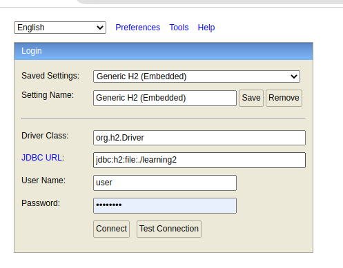
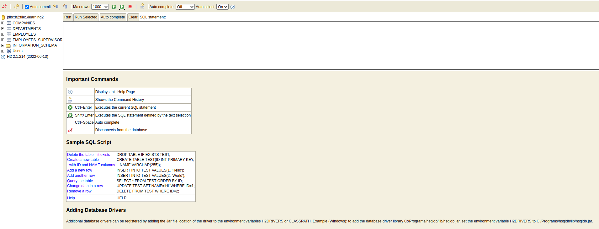
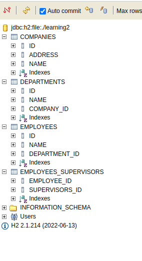

# Adding more fields and relationships to our Employee entity
# ----------------------------------------------------------
To showcase more powerful queries, we need to have the employee entity have more fields and relationships. We will add the following fields and relationships to the employee entity:
+ dateOfBirth: LocalDate
+ number: String
+ dateOfEmployment: LocalDate
+ salary: BigDecimal
+ department: Department
+ role: An enumeration {SUPERVISOR, EMPLOYEE}

+ The relationship we include will be as follows:
  + Department
    + An employee is placed in a department at a time.
    + Many Employees can be in the same department (Many-to-One)
    + Fields:
      + name: e.g IT, Finance, Marketing
    + Relationships: 
      + Employee: One to Many (From this direction a department can have many employees)
      + Company: Many to One (From this direction, many departments can belong to a company, with a department having at most 1 company)
  + Supervisor: A supervisor is an Employee whose role is a supervisor.
    + An employee can have many supervisors (Many-to-Many)
    + A supervisor can supervise many employees (Many-to-Many)
  + Company: A company has many departments.
    + A department belongs to a company (Many-to-One)
    + Fields:
      + name: e.g Meliora Technologies
      + address: e.g 1234, Nairobi, Kenya
Let's kick in and add these fields and relationships to our Employee entity.

## Adding new Entities
- Since we've already made the employee entity a domain entity, let's move it to the domain package. Since we don't have any more entities in the picture, I will just refactor the package name to `com.pmutisya.learnspringboot.domain`.
- Let's create in this new package, a new class called `Department`. This will be a domain entity. Let's add the following fields to it:
  + name: String
  + employees: List<Employee>

## Adding Lombok
- Let's save ourselves from writing boilerplate code of getters and setters by adding a dependency called Lombok. [https://projectlombok.org/](https://projectlombok.org/)
- We will also add an exclusion to spring boot to tell it not to add Lombok jar files to our jar files during build process. 
- With that, we will annotate all our classes with `@Data` which gives us getters and setters for each field, and also a human-readable toString(). For the employee class, we will also add `@NoArgsConstructor` and `@AllArgsConstructor`, since we are using the all arguments constructor in our tests.

```java
package com.pmutisya.learnspringboot.domain;

import jakarta.persistence.*;
import lombok.Data;

@Entity
@Table(name = "companies")
@Data
public class Company {
    @Id
    @GeneratedValue(strategy = GenerationType.IDENTITY)
    private Integer id;

    private String name;

    private String address;
}
```

```java
package com.pmutisya.learnspringboot.domain;

import jakarta.persistence.*;
import lombok.Data;

@Entity
@Table(name = "departments")
@Data
public class Department {
    @Id
    @GeneratedValue(strategy = GenerationType.IDENTITY)
    private Integer id;

    private String name;

    @ManyToOne
    private Company company;
}
```

```java
package com.pmutisya.learnspringboot.domain;

import jakarta.persistence.*;
import lombok.AllArgsConstructor;
import lombok.Data;
import lombok.NoArgsConstructor;

import java.util.List;

@Entity
@Table(name = "employees")
@Data
@NoArgsConstructor
@AllArgsConstructor
public class Employee {
    @Id
    @GeneratedValue(strategy = GenerationType.IDENTITY)
    private Integer id;
    private String name;
    @ManyToOne
    private Department department;
    @ManyToMany
    private List<Employee> supervisors;
}
```

## Adding new Resources, and Controllers for our new entities
- We will create the following new resources:
  + `com.pmutisya.learnspringboot.web.rest.CompanyResource`
  + `com.pmutisya.learnspringboot.web.rest.DepartmentResource`
  + `com.pmutisya.learnspringboot.service.CompanyService`
  + `com.pmutisya.learnspringboot.service.DepartmentService`
  + `com.pmutisya.learnspringboot.repository.CompanyRepository`
  + `com.pmutisya.learnspringboot.repository.DepartmentRepository`

+ Now that we're done, and have enabled data tables generation using hibernate, let's take a look at our data. If you're using MySQL, you can set up a connection to your database using MySQL Workbench, or mysql client. In our case, we are using h2, so we will use the h2 console to view our data. To do this, we will add the following properties to our application.yaml file:
```yaml
spring:
  datasource:
    driver-class-name: org.h2.Driver
    url: jdbc:h2:file:./learning2
    username: user
    password: password
  jpa:
    database-platform: org.hibernate.dialect.H2Dialect
    hibernate:
      ddl-auto: update
    generate-ddl: true
  h2:
    console:
      enabled: true
      path: /h2-console
```
+ Re-start your application, and visit [http://localhost:8080/h2-console](http://localhost:8080/h2-console). You should see a login page. You should see a page like this: 
+ Enter the credentials you specified in the application.yaml file, and click connect.
+ You will then be taken to a page like this: .

## How relationships are represented

### X-to-One (Many-to-One, One-to-One)
- A X-to-One relationship, a term I've just coined right now, is represented as a field Id in the entity. For example, in our case, we have a Many-to-One relationship between Employee and Department. This is represented as a field called departmentId in the Employee entity. This is a foreign key to the department table. This is the same for a One-to-One relationship. The only difference is that in a One-to-One relationship, the foreign key is unique, and in a Many-to-One relationship, the foreign key is not unique.  
- The foreign key is by default named `relationshipName` + `Id`. In our case, the relationship name is `department`, so the foreign key is `departmentId`. We can change this by adding the `@JoinColumn` annotation to the field. For example, if we want to change the foreign key to `department_id`, we can do this:
```java
@ManyToOne
@JoinColumn(name = "dept_id")
private Department department;
```
- Table `departments` als0 has `company_id` field which refers to the table `companies`'s `id` field. This is a Many-to-One relationship.
### Many-to-Many
- Many-to-Many relationships require an extra table to be represented. This is called the Pivot table. An Employee can have many supervisors, and a supervisor can supervise many employees. This is a Many-to-Many relationship. To represent this, we have a table called `employee_supervisors` which has two fields, `employee_id` and `supervisor_id`. Both of these fields are foreign keys to the `employees` table. This is a Many-to-Many relationship.
- There are special cases where we may need to define more attributes to our Many-to-Many relationships. For example, let's say for each Employee supervisory, we indicate the number of hours supervised, and the nature of supervision. We can map this into a Many-ToMany relationships with attributes.
- In our entities, we can simply create a new entity and call it EmployeeSupervision. This entity will have the following fields:
  + id: Integer
  + employee: Employee
  + supervisor: Employee
  + hoursSupervised: Integer
  + natureOfSupervision: String
+ Employee will this have Many-to-One relationships with EmployeeSupervision, and EmployeeSupervision will have Many-to-One relationships with Employee. This will be a Many-to-Many relationship with attributes.
### One-to-Many
- In our entities, a One-to-Many relationship is represented in a List of the referenced entities, just like a Mant-to-Many. However, in our tables, a One-to-many relationship is not represented in the table structure. Instead, it is created as a Mant-to-One relationship, but from the other entity.
- For example, in our entities, we have a One-to-Many relationship between Company and Department. This is represented in the Company entity as a List of Departments. However, in our tables, this is represented as a Many-to-One relationship between Department and Company. This is because the Department table has a foreign key to the Company table. This is a Many-to-One relationship.
- _Remember: One-To-Many relationships are just Many-to-One relationships as viewed from the referenced entity_
### Self Relationships
- Relationships are not limited to different tables. As we saw in our case up there, an Employee can relate to another Employee. This is a self relationship. In our case, we have a Many-to-Many relationship between Employee and Employee. This is represented in our tables as a Many-to-Many relationship between Employee and Employee. This is a Many-to-Many relationship.
- _Remember: It's rows (Objects) that relate, not tables (Classes)_
